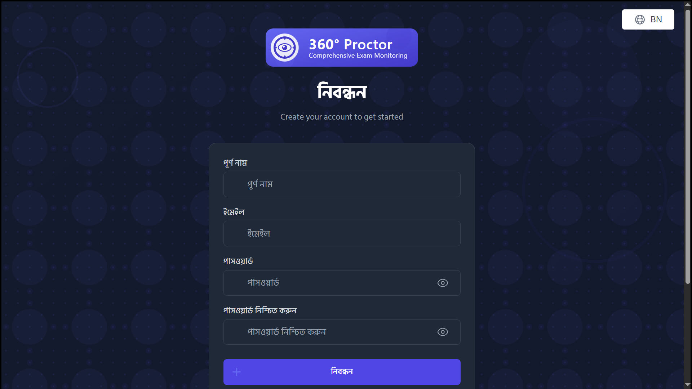
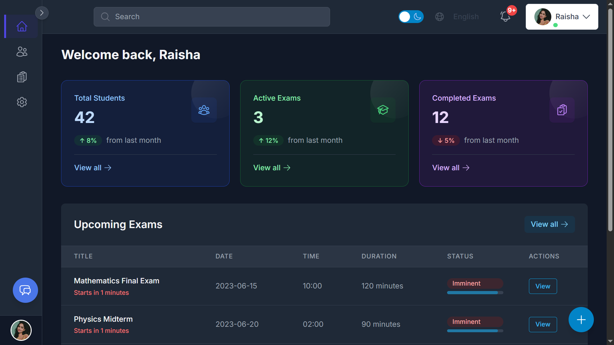
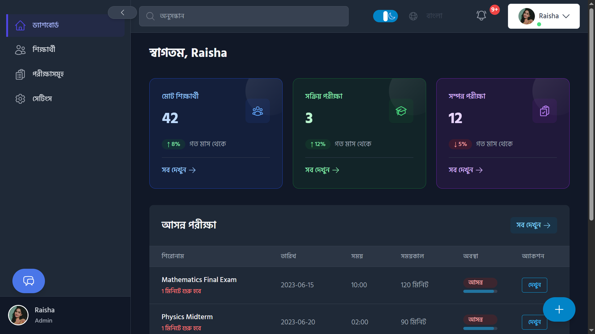
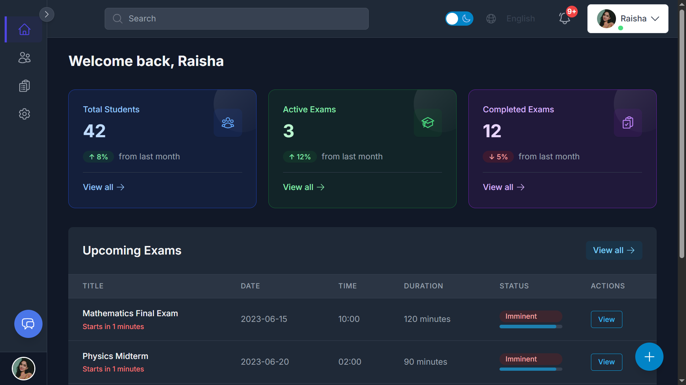

# 360° Proctor

A full-featured, multilingual (Bangla & English) online exam proctoring system designed specifically for the Bangladeshi education market. The system features a responsive design that works seamlessly across desktop, tablet, and mobile devices.

<div align="center">
  
</div>

<p align="center">
  <a href="#features">Features</a> •
  <a href="#tech-stack">Tech Stack</a> •
  <a href="#responsive-design">Responsive Design</a> •
  <a href="#dashboard-showcase">Dashboard Showcase</a> •
  <a href="#getting-started">Getting Started</a> •
  <a href="#roadmap">Roadmap</a>
</p>

## Features

<div align="center">
  
</div>

### Proctoring Capabilities

- Real-time AI-powered proctoring
  - Face detection and verification
  - Multiple people detection
  - Eye movement tracking
  - Audio analysis (speech-to-text)
  - Tab switching detection
  - Phone usage detection
- Trust Score system based on suspicious activities
- Comprehensive exam reports with screenshots and timelines

### User Experience

- Fully responsive admin and teacher dashboards
- Multilingual support (Bangla & English) with easy language switching
- Intuitive exam management interface with consistent navigation
- Elegant back button and page header components for improved navigation
- Real-time violation alerts with notification system
- Detailed student performance analytics
- Feedback system with form validation and accessibility features

### Technical Features

- JWT Authentication and role-based access control
- WebSocket-based real-time communication
- Secure API endpoints with proper validation
- Optimized database queries for performance

## Tech Stack

### Backend

- **FastAPI** (Python) - High-performance web framework
- **PostgreSQL** - Relational database
- **WebSockets** - For real-time communication
- **JWT** - For secure authentication
- **AI models** - For proctoring features

### Frontend

- **React.js** - UI library
- **Tailwind CSS** - Utility-first CSS framework
- **Headless UI** - Unstyled, accessible UI components
- **react-i18next** - Internationalization
- **Recharts** - Responsive charting library
- **Axios** - HTTP client

## Responsive Design

The application features a comprehensive responsive design that works across all device sizes:

### Mobile Experience

- Slide-in drawer navigation
- Optimized tables with horizontal scrolling
- Touch-friendly controls and forms
- Stacked layouts for better readability
- Properly sized touch targets

### Tablet Experience

- Adaptive layouts that make use of available space
- Collapsible sidebar
- Responsive tables with prioritized columns
- Optimized forms and modals

### Desktop Experience

- Expanded layouts with multi-column content
- Hover-expandable sidebar
- Full-featured tables and data visualization
- Advanced filtering and search capabilities

### UI Components

- **BackButton**: Clean, integrated back navigation with proper styling and accessibility
- **PageHeader**: Consistent page headers with title and optional actions
- **FeedbackForm**: Interactive feedback system with validation and character counting
- **NotificationBell**: Real-time notification system with unread indicators
- **DarkModeToggle**: Persistent theme preference with smooth transitions

### Dashboard Showcase

<div align="center">
  <p><strong>Main Dashboard Overview</strong></p>
  
  <br><br>
  <p><strong>Exam Management Interface</strong></p>
  
  <br><br>
  <p><strong>Analytics and Reporting</strong></p>
  
</div>

## Project Structure

```bash
360-proctor/
├── backend/                # FastAPI backend
│   ├── app/
│   │   ├── api/            # API routes
│   │   ├── core/           # Core functionality
│   │   ├── db/             # Database models
│   │   ├── schemas/        # Pydantic schemas
│   │   ├── services/       # Business logic
│   │   ├── ai/             # AI models integration
│   │   └── websockets/     # WebSocket handlers
│   └── tests/              # Backend tests
├── frontend/               # React.js frontend
│   ├── public/             # Static files
│   │   ├── logo.svg        # 360° Proctor logo
│   │   └── favicon.svg     # 360° Proctor favicon
│   ├── src/
│   │   ├── components/     # Reusable UI components
│   │   │   ├── common/     # Common UI elements (BackButton, FeedbackForm, etc.)
│   │   │   ├── layout/     # Layout components (PageHeader, Sidebar, etc.)
│   │   │   ├── dashboard/  # Dashboard-specific components
│   │   │   └── notifications/ # Notification system components
│   │   ├── hooks/          # Custom React hooks
│   │   ├── pages/          # Page components
│   │   ├── services/       # API service functions
│   │   ├── utils/          # Utility functions
│   │   ├── locales/        # Translation files
│   │   └── App.jsx         # Main application component
│   └── package.json        # Frontend dependencies
├── docs/                   # Documentation
└── scripts/                # Utility scripts
```

## Getting Started

### Prerequisites

- Python 3.9+
- Node.js 16+
- PostgreSQL
- npm or yarn

### Backend Setup

```bash
# Navigate to backend directory
cd backend

# Create a virtual environment
python -m venv venv

# Activate the virtual environment
# On Windows
venv\Scripts\activate
# On macOS/Linux
source venv/bin/activate

# Install dependencies
pip install -r requirements.txt

# Set up environment variables
cp .env.example .env
# Edit .env with your database credentials

# Run migrations
alembic upgrade head

# Start the development server
uvicorn app.main:app --reload
```

### Frontend Setup

```bash
# Navigate to frontend directory
cd frontend

# Install dependencies
npm install
# or
yarn install

# Start the development server
npm run dev
# or
yarn dev
```

### Accessing the Application

- Backend API: `http://localhost:8000`
- Frontend: `http://localhost:3000`
- API Documentation: `http://localhost:8000/docs`

## Development Guidelines

### Code Style

- Backend: Follow PEP 8 guidelines
- Frontend: ESLint and Prettier configuration provided

### Branching Strategy

- `main`: Production-ready code
- `develop`: Development branch
- Feature branches: `feature/feature-name`
- Bug fixes: `fix/bug-name`

### Commit Messages

Follow conventional commits format:

- `feat`: New feature
- `fix`: Bug fix
- `docs`: Documentation changes
- `style`: Code style changes
- `refactor`: Code refactoring
- `test`: Adding or updating tests
- `chore`: Maintenance tasks

## Roadmap

### Short-term Goals

- Enhanced mobile experience
- AI-driven cheating pattern detection
- Alerting via email or SMS

### Mid-term Goals

- Offline/unstable network tolerance
- Integration with popular LMS platforms
- Advanced analytics dashboard

### Long-term Goals

- Marketplace for exam packages
- Browser extension for enhanced proctoring
- Machine learning for personalized exam security

## License

This project is licensed under the MIT License - see the LICENSE file for details.

## Acknowledgements

- [FastAPI](https://fastapi.tiangolo.com/)
- [React](https://reactjs.org/)
- [Tailwind CSS](https://tailwindcss.com/)
- [Headless UI](https://headlessui.dev/)
- [react-i18next](https://react.i18next.com/)
